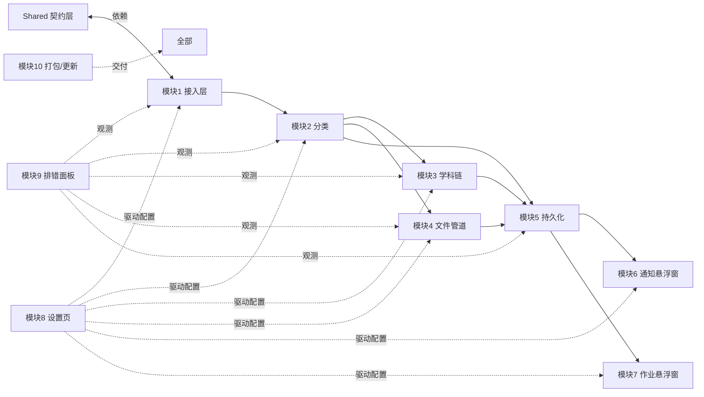

# 总体架构说明

> 项目：ClassIng（ClassIsland QQ 群消息接管与课堂信息分发系统）
> 模块：模块 0 —— 调研与总体设计
> 宿主：ClassIsland master（Avalonia 11.3.17 / net8.0 / 插件 apiVersion 2.0.0.0）

---

## 1. 系统架构图

```mermaid
flowchart TB
    subgraph QQ侧
        QQ[QQ 群消息<br/>文本 / 图片 / 文件 / @全体]
        NAP[NapCat 协议端<br/>OneBot 11 · 独立进程]
    end

    subgraph ClassIsland宿主进程["ClassIsland 宿主进程（ClassIng 插件）"]
        direction TB

        subgraph 接入层["消息接入层（模块1）"]
            WS[OneBot WebSocket 客户端<br/>自研：连接/心跳/指数退避重连]
            RQ[RetryQueueItem 重试队列<br/>断线期间消息缓存]
        end

        subgraph 管道["分类管道（模块2/3/4）"]
            CLS[通知/作业分类器<br/>IMessageClassifier]
            SUB[三级学科识别链<br/>ISubjectClassifier<br/>①关键词规则 → ②本地ONNX小模型 → ③云端LLM(可选)]
            FILE[文件处理器<br/>IFilePipelineService<br/>下载 · MD5去重 · 归档]
            PEND[人工确认队列<br/>PendingConfirmItem]
        end

        subgraph 持久化["持久化层（模块5）"]
            NS[(NoticeStore<br/>notices.json)]
            HS[(HomeworkStore<br/>homework.json)]
            FS[(FileStore<br/>files.json + MD5索引)]
            CFG[(AppSettings<br/>settings.json)]
        end

        subgraph UI["表现层（模块6/7/8/9）"]
            W1[通知悬浮窗<br/>NoticeSuspensionWindow]
            W2[作业悬浮窗<br/>HomeworkSuspensionWindow]
            SP[设置页<br/>ClassIngSettingsPage]
            DBG[排错面板<br/>诊断日志/连接状态/重放]
        end

        CTRL[悬浮窗控制器<br/>ISuspensionWindowController<br/>位置/大小/透明度/字号/复位]
        TRAY[托盘菜单项<br/>ITaskBarIconService]
        UPD[更新通知<br/>IUpdateNotifyService（模块10）]
        NT[ClassIsland 通知宿主<br/>NotificationProvider（可选联动）]
    end

    QQ --> NAP
    NAP <-->|OneBot 11 JSON<br/>WebSocket| WS
    WS --> RQ
    WS --> CLS
    CLS -->|作业| SUB
    CLS -->|通知| NS
    SUB -->|高置信| HS
    SUB -->|低置信| PEND
    CLS -->|含文件| FILE
    FILE --> FS
    FILE -->|文件属于作业| HS
    PEND -->|人工确认| HS
    NS --> W1
    HS --> W2
    FS --> W2
    CTRL --- W1
    CTRL --- W2
    CFG -.配置.-> 接入层
    CFG -.配置.-> 管道
    CFG -.配置.-> UI
    SP --> CFG
    DBG --> 接入层
    DBG --> 管道
    TRAY --- W1
    UPD --> W1
    CLS -.上课场景联动.-> NT
```

## 2. 模块划分与依赖关系

| 模块 | 名称 | 职责 | 依赖 |
| --- | --- | --- | --- |
| 模块 1 | QQ 消息接入层 | OneBot 11 WebSocket 客户端、心跳、指数退避重连、`message_id` 幂等去重、断线缓存（重试队列） | ClassIng.Shared（契约）；NapCat（外部） |
| 模块 2 | 消息分类管道 | 通知/作业分类（`IMessageClassifier`），产出 `ClassifiedMessage`，路由到学科识别/文件处理/通知存储 | 模块 1（输入）；Shared |
| 模块 3 | 学科识别链 | 三级链：SubjectRule 关键词 → 本地 ONNX 小模型 → 云端 LLM（可选）；输出 `SubjectResult{Subject, Confidence, Level}`；低置信进入人工确认队列 | 模块 2；Shared；OnnxRuntime（可选加载） |
| 模块 4 | 文件管道 | 从 OneBot 文件/图片事件下载、MD5 去重、按 `归档目录/学科/日期` 归档、产出 `FileRecord` | 模块 1/2；Shared |
| 模块 5 | 持久化层 | `INoticeStore` / `IHomeworkStore` / 文件索引的 JSON 读写、已读状态、原子写入与损坏恢复 | Shared |
| 模块 6 | 通知悬浮窗 | 最新通知展示（Avalonia 无边框置顶窗），点击已读、淡出 | 模块 5；Shared；`ISuspensionWindowController` |
| 模块 7 | 作业悬浮窗 | 按学科分组展示作业列表与附件，已读/完成状态 | 模块 5；Shared；`ISuspensionWindowController` |
| 模块 8 | 设置页 | 五组设置（连接/分类/悬浮窗/文件/维护）在 ClassIsland 设置窗口注册与编辑 | Shared；宿主 SettingsPageBase |
| 模块 9 | 排错面板 | 连接状态、最近原始消息快照（脱敏）、管道处理日志、消息重放、手动重连 | 模块 1/2/3/4/5 |
| 模块 10 | 打包与更新通知 | .cipx 构建、GitHub Actions CI、新版本检查与提示（`IUpdateNotifyService`） | 全部 |

**依赖关系（自上而下单向）**：



规则：
1. **所有模块只依赖 `ClassIng.Shared` 契约（接口+DTO），模块间不直接引用实现类**，由 DI 容器组装；
2. 表现层（6/7/8/9）不触碰接入层细节，仅消费 Store 与 Controller 接口；
3. 模块 3 的 ONNX / LLM 能力为**可选加载**：运行时探测（模型文件存在 / 设置启用）决定加载哪一级识别器，未加载时自动降级到上一级。

## 3. 降级策略（全局）

| 故障 | 降级行为 |
| --- | --- |
| WebSocket 断线 | 指数退避重连（初始 2s，倍增，上限 5min）；断线期间接收动作失败的操作进 RetryQueueItem |
| 分类器（模块 2）异常 | 消息按"未知"通知入存，原始快照保留供排错面板重放 |
| ONNX 模型缺失/加载失败 | 跳过第②级，直接走关键词规则 → 低置信进人工确认队列 |
| LLM API 失败/未启用 | 同上，落人工确认队列 |
| 文件下载失败 | RetryQueueItem 重试（指数退避），悬浮窗展示"附件处理中" |
| 存储文件损坏 | 从 `.bak` 恢复；不可恢复时保留损坏文件并空库启动，排错面板告警 |
| 悬浮窗创建失败（UI 线程异常） | 降级为 ClassIsland 通知宿主弹窗（NotificationProvider）+ 托盘图标提示 |

## 4. 插件项目结构建议（结论）

**结论：采用「单插件项目（ClassIng.Plugin）+ 独立共享契约项目（ClassIng.Shared）」共两个项目的解决方案；插件内部按文件夹分层。** 不拆分为主插件+多个子项目。

理由：
1. ClassIsland 插件以**单一入口程序集**（manifest `entranceAssembly`）加载，多程序集需要全部随 .cipx 分发并处理好程序集解析顺序——master 加载器对插件附属程序集的处理没有公开保证，多子项目徒增装载风险；
2. 悬浮窗/设置页/管道服务间共享 ViewModel 与服务较多，同项目内文件夹分层（`Services/ Models/ Views/ Controls/ Utils/`）编译期检查最直接；
3. `ClassIng.Shared` 单独成项目的唯一目的：**契约与宿主/UI/JSON 实现解耦**——它不引用 Avalonia、不引用 ClassIsland.Core，可被未来的独立接入器进程、单元测试工程直接复用，也能独立编译验证；
4. 未来的"独立接入器进程"（若需要）也只引用 Shared，不引用插件项目，保持依赖方向单一。

### 目录规划

```
D:\!Mine\plays\ClassIng\
├─ docs\                          # 本模块交付文档
├─ src\
│  ├─ ClassIng.Shared\            # 契约层（纯 net8.0 类库，无 Avalonia/宿主依赖）
│  │  ├─ Models\                  # DTO：MessageRecord / ClassifiedMessage / NoticeItem / ...
│  │  ├─ Abstractions\            # 接口：IMessageIngestService / IMessageClassifier / ...
│  │  └─ ClassIng.Shared.csproj
│  └─ ClassIng.Plugin\            # 模块 1~9 实现（后续模块创建，本模块不实现）
│     ├─ Services\                # 接入/分类/识别/文件/存储/重试 实现
│     ├─ Views\                   # 悬浮窗、排错面板（Avalonia）
│     ├─ Controls\                # 设置页与附属控件
│     ├─ manifest.yml
│     └─ ClassIng.Plugin.csproj   # 引用 ClassIsland.PluginSdk，CreateCipx=true
├─ ClassIsland\                   # 上游源码（只读参考，不修改）
└─ ClassIng.sln                   # 解决方案
```

## 5. 关键数据流（示例）

**作业消息 → 作业悬浮窗**：
1. NapCat 推送群消息事件（`message_type=group`，含文本"明天第一节课交数学练习册P23"与图片段）；
2. 模块 1 幂等校验（`message_id`）后产出 `MessageRecord`（原始 JSON 快照+脱敏）；
3. 模块 2 分类为"作业"，抽取文本与文件引用 → `ClassifiedMessage`；
4. 模块 3 第①级命中关键词"练习册/P23"+"数学"→ `SubjectResult{数学, 0.9, 关键词}`；
5. 图片段交模块 4 下载、MD5 去重、归档至 `Files\数学\2026-09-03\`；
6. `HomeworkItem`（学科=数学，置信度 0.9，来源级别=关键词，附件=FileRecord）写入 HomeworkStore；
7. 悬浮窗控制器刷新作业悬浮窗分组列表；低置信场景则先入人工确认队列。
