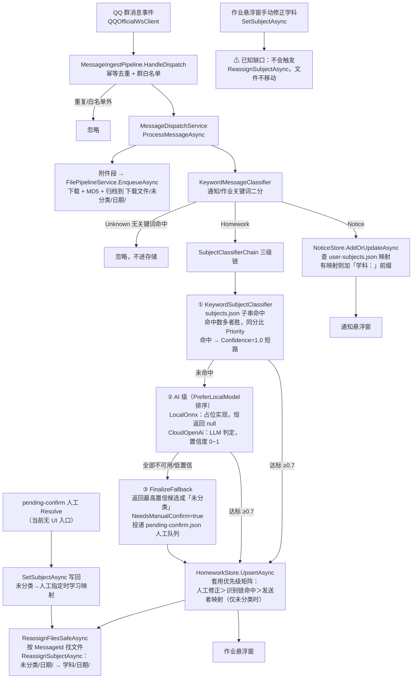

# ClassIng 分类机制全解：老师只发通知怎么归类学科？文件到底怎么分类的？

> 调研文档，未改动任何代码。所有结论均基于仓库内真实源码（`src/`），引用处给出文件路径与方法名；
> 个别无法从代码直接确认的点已明确标注「未验证」。
>
> 阅读顺序说明：问题 a（通知老师归类）的全部方案都建立在问题 b（分类链路）的机制之上，
> 因此本文先讲问题 b 的完整链路，再在机制基础上对比问题 a 的四种方案。

---

## 目录

- [太长不看（核心结论）](#太长不看核心结论)
- [上篇：问题 b —— 文件到底怎么分类的？](#上篇问题-b--文件到底怎么分类的)
  - [1. 消息进来：接入与「通知/作业」二分](#1-消息进来接入与通知作业二分)
  - [2. 学科识别三级链](#2-学科识别三级链)
    - [第①级：关键词规则（KeywordSubjectClassifier）](#第级关键词规则keywordsubjectclassifier)
    - [第②级（本地）：ONNX 模型——占位实现](#第级本地onnx-模型占位实现)
    - [第②级（云端）：CloudOpenAiProvider](#第级云端cloudopenaiprovider)
    - [第③级：兜底与人工确认队列](#第级兜底与人工确认队列)
  - [3. 文件两步归档](#3-文件两步归档)
  - [4. 低置信度 → 人工确认的阈值在哪一行](#4-低置信度--人工确认的阈值在哪一行)
  - [5. 按发送者映射（user-subjects.json）与优先级矩阵](#5-按发送者映射user-subjectsjson与优先级矩阵)
  - [6. 全链路流程图](#6-全链路流程图)
- [下篇：问题 a —— 老师只发通知、没发过作业，如何归类学科？](#下篇问题-a--老师只发通知没发过作业如何归类学科)
  - [现状：为什么通知老师永远归不了类](#现状为什么通知老师永远归不了类)
  - [方案对比（①②③④）](#方案对比)
  - [推荐与理由](#推荐与理由)

---

## 太长不看（核心结论）

**关于「本地模型」的真实状态**：`LocalOnnxAiProvider` 是**占位实现（可运行骨架）**。它会检查 `AiEnabled` 开关和模型文件（默认 `models/subject-classifier.onnx`）是否存在，但 `ClassifyAsync` 里没有加载任何 ONNX 会话——只记一条 Warning 日志后返回 `null`，直接把请求交给云端 LLM 或人工队列。没有输入特征构造、没有输出到学科的映射、没有置信度阈值，这些都尚未实现。

**关于问题 a 的推荐**：现状下，只发通知的老师**没有任何归类路径**——学科识别链只对「作业」消息运行，通知只做「通知/作业」二分后直接写入 `notices.json`。推荐组合方案：**② 通知人工指定学科 → 学习「发送者→学科」映射**（一次指定、永久生效，通知前缀与未分类作业同时受益），并**配套 ③ 映射管理页**用于查看与纠错；①（通知文本也走识别链）可作为低成本的并行增强。不建议 ④（首次命中自动升级映射）作为默认行为——一次关键词误命中就会把映射固化，而当前没有纠错入口。

---

# 上篇：问题 b —— 文件到底怎么分类的？

## 1. 消息进来：接入与「通知/作业」二分

消息的入口在 `src/ClassIng.Plugin/Services/Pipeline/MessageDispatchService.cs`（集成接线器，`IHostedService`）：

1. **接入**：`Services/MessageAccess/MessageIngestService.cs` 持有 QQ 官方 WebSocket 客户端（`QQOfficialWsClient`），收到分发事件后交给 `MessageIngestPipeline.HandleDispatch`——做**幂等去重**（`MessageIdempotencyStore`，协议端重发只处理一次）、**群白名单过滤**，再映射为 `MessageRecord`（含文本段与文件/图片/视频段）。
2. **二分**：`ProcessMessageCoreAsync` 先调用 `Services/Classification/KeywordMessageClassifier.ClassifyAsync`（模块 2）。这是**关键词规则**分类器，词表来自 `classification-keywords.json`（默认通知词：`通知/注意/提醒/广播`，作业词：`作业/练习/提交/完成`）：
   - 只命中作业词 → `Homework`；只命中通知词 → `Notice`；**两侧都命中 → 作业优先**（作业漏检成本更高）；都没命中 → `Unknown`，**这条消息直接被忽略**（只记 Debug 日志，不进任何存储）。
   - 注意：这一级只区分「通知还是作业」，**不做学科判断**。学科识别只发生在 `Homework` 分支。

   ```13:15:src/ClassIng.Plugin/Services/Pipeline/MessageDispatchService.cs
   /// 数据流：<see cref="IMessageIngestService.MessageReceived"/> →
   /// <see cref="IMessageClassifier.ClassifyAsync"/>（通知/作业二分）→
   /// - 通知：<see cref="INoticeStore.AddOrUpdateAsync"/>；
   ```

3. **附件入队（与消息类型无关）**：`EnqueueFileSegmentsAsync` 把消息里的文件/图片/视频段（带直链的）全部送进文件管道 `IFilePipelineService.EnqueueAsync`——**即使是纯通知，附件也会被下载归档**。

## 2. 学科识别三级链

`Services/SubjectChain/SubjectClassifierChain.cs` 是三级降级链组合器，**永不返回 null**：
①关键词 → ②AI（本地 ONNX / 云端 LLM，按 `PreferLocalModel` 排序，任一级置信度达标即返回）→ ③兜底 + 人工确认队列投递。任何一级异常都自动进入下一级。

### 第①级：关键词规则（KeywordSubjectClassifier）

文件：`Services/SubjectChain/KeywordSubjectClassifier.cs`，词表为外置的 **`subjects.json`**。

- **词表加载优先级**（`Services/SubjectChain/SubjectRuleFile.cs` 的 `LoadOrSeed`）：
  数据目录 `subjects.json`（用户可编辑、热重载）→ 首次运行从 `Assets/subjects.json` 模板复制种子 → 模板也缺失时用内置默认规则。仓库内置模板覆盖 9 个学科（数学/语文/英语/物理/化学/生物/历史/地理/政治），每学科一组关键词 + `priority`。
- **subjects.json 结构**（`ClassIng.Shared/Models/MessageModels.cs` 的 `SubjectRule`；顶层是 `{ "rules": [ ... ] }`）：

  ```json
  {
    "rules": [
      { "subject": "数学", "keywords": ["数学", "代数", "几何", "函数", "方程"], "priority": 10 }
    ]
  }
  ```

  `subject` 同时用作文件归档目录名，所以词表编辑页会用与文件管道同口径的路径安全校验（`SubjectRulesEditorLogic.IsUnsafeSubjectName`）。
- **命中规则**：对文本做子串包含匹配（`string.Contains`，忽略大小写）。**命中关键词数最多的学科胜出；命中数相同则 `Priority` 大者胜**（`Priority` 只在同分时起作用，不做加权）；全部 0 命中返回 `null`，链进下一级。
- 命中即返回 `Confidence = 1.0`、`Source = SubjectSource.KeywordRule`、`Reason = keyword_hit=[...]`——**1.0 必然超过阈值，直接短路返回，不再走 AI**。

### 第②级（本地）：ONNX 模型——占位实现

文件：`Services/SubjectChain/LocalOnnxAiProvider.cs`。**如实说明：这是可运行骨架，推理为占位实现，不产生任何分类结果。**

- `IsAvailable`：检查设置 `AiEnabled`（默认 `true`）+ 模型文件是否存在（`ClassificationSettings.LocalModelPath`，默认 `models/subject-classifier.onnx`，相对路径时基于插件数据目录解析）。文件不存在 → 本级被跳过。
- `ClassifyAsync`：即使模型文件存在，实际执行的是：

  ```72:77:src/ClassIng.Plugin/Services/SubjectChain/LocalOnnxAiProvider.cs
              var settings = _provider.SafeGetSettings();
              // —— 推理占位：真实 ONNX 会话加载与 tokenizer 接入见交付报告「已知缺口」 ——
              _logger.LogWarning(
                  "本地 ONNX 推理为占位实现（modelPath={ModelPath}），返回 null 交给下一级",
                  ResolveModelPath(settings));
              return Task.FromResult<SubjectResult?>(null);
  ```

  即：**没有 InferenceSession、没有 tokenizer、没有输入特征构造、没有输出标签→学科的映射、没有本地置信度阈值**。类注释也明说「当前为可运行骨架……推理调用以占位实现」。项目未引用 `Microsoft.ML.OnnxRuntime`（未验证 csproj 之外是否有独立引用，但从实现看没有任何推理调用）。
- **实际效果**：设置里的 `PreferLocalModel = true`（本地优先）只是排序声明——本地级永远返回 `null`，所以第②级实际兜底的是云端 LLM；云端未配置时直接落第③级人工兜底。

### 第②级（云端）：CloudOpenAiProvider

文件：`Services/SubjectChain/CloudOpenAiProvider.cs`，OpenAI 兼容 `chat/completions` 接口。

- **启用条件**（`IsAvailable`）：`AiEnabled` + `CloudEndpoint` 非空 + `CloudApiKeyProtected` 能解密出非空密钥 + **今日调用数未超 `CloudDailyCallLimit`（默认 200 次/日，跨日清零）**。任一不满足 → 跳过本级别。
- **提示词**（`SystemPrompt` 常量）：

  > 「你是中小学作业学科分类器。根据用户文本判断学科（数学/语文/英语/物理/化学/生物/历史/地理/政治）。只输出 JSON：{"subject":"<学科>","confidence":<0到1的小数>,"reason":"<简短理由>"}，不要输出其他内容。」

  用户消息就是原始文本，`temperature = 0`。
- **输出映射**：从返回文本中提取首个 `{...}` JSON（容忍 ```json 围栏，`ParseVerdict`），反序列化为 `{"subject","confidence","reason"}`；`subject` 字符串原样作为学科名（**会校验非空，但不校验是否在九学科白名单内**——LLM 返回生僻学科名会原样进入存储并成为归档目录名，`ReassignSubjectAsync` 侧有路径安全校验兜底）；`confidence` 被 `Math.Clamp` 到 0~1。
- **超时/重试**：HttpClient 超时 20 秒；**单次尝试、无重试**——HTTP 非 2xx、JSON 解析失败、异常都只记 Warning/Error 日志后返回 `null` 进下一级（消息级别的失败重试由 `RetryQueueService` 的 `SubjectClassify` 重试执行器在 `ProcessHomeworkAsync` 捕获链异常时触发，链内低置信不重试）。

### 第③级：兜底与人工确认队列

全部级别都没给出高置信结果时，`SubjectClassifierChain.FinalizeFallbackAsync`：

- 取**候选中置信度最高者**作为返回值（保留线索）；一个候选都没有 → `Subject="未分类"`、`Confidence=0`、`Source=Manual`、`Reason=chain_all_failed`。
- 无论哪种，都置 **`NeedsManualConfirm = true`**，并在 `ManualConfirmQueueEnabled`（默认开）时投递 `JsonPendingConfirmStore`（`pending-confirm.json`，同 MessageId 幂等）。
- **注意**：人工确认队列的 `ResolveAsync` 目前在插件源码内**没有发现任何 UI 调用入口**（全仓库 grep 仅 `Abstractions.cs` 接口定义与 `JsonPendingConfirmStore` 自身实现，未验证是否有计划中的界面）。写回钩子 `Resolved → MessageDispatchService.OnPendingResolvedAsync → HomeworkStore.SetSubjectAsync + 文件二次归档` 已接线，但缺一个触发它的界面。

## 3. 文件两步归档

文件管道：`Services/Files/FilePipelineService.cs`（模块 4）。

**第一步：下载即归「未分类」。** `EnqueueAsync → DownloadAndArchiveAsync → ArchiveFile`：

- 原子下载（`.download-*.tmp` 临时文件）→ 流式 MD5 → MD5 去重 → 归档到 **`下载文件/<学科>/<yyyy-MM-dd>/<文件名>`**；学科在识别完成前固定为 `"未分类"`：

  ```23:23:src/ClassIng.Plugin/Services/Files/FilePipelineService.cs
      private const string UnfiledSubject = "未分类";
  ```

  （`GroupBySubject = false` 时不分学科目录，只按日期归档，也就没有第二步。）
- 调用点：`MessageDispatchService.EnqueueFileSegmentsAsync`——**在通知/作业类型判定之前**，所有带直链的附件段都会入队。

**第二步：学科确定后二次归档。** `ReassignSubjectAsync(fileId, subject)` 把文件从 `未分类/<日期>/` 移到 `<学科>/<日期>/`（保持日期层，幂等：已在目标目录则跳过）。触发点有两个：

1. **`ProcessHomeworkAsync` 之后**（自动识别完成）：`MessageDispatchService.ProcessHomeworkAsync` 末尾调用 `ReassignFilesSafeAsync(messageId, subject)`，按 MessageId 找到该消息的全部文件记录逐个 `ReassignSubjectAsync`；
2. **人工确认 Resolve 之后**：`OnPendingResolvedAsync`（`pending-confirm.json` 的 `Resolved` 钩子）写回作业学科后同样调用 `ReassignFilesSafeAsync`。

**已知缺口（现状确认）**：**作业悬浮窗手动修正学科不会移动文件。** `Views/HomeworkSuspensionWindow.axaml.cs` 的 `OnSubjectSelectionChanged` 只调用了 `HomeworkStore.SetSubjectAsync`：

```207:217:src/ClassIng.Plugin/Views/HomeworkSuspensionWindow.axaml.cs
    private async void OnSubjectSelectionChanged(object? sender, SelectionChangedEventArgs e)
    {
        try
        {
            if (sender is ComboBox { DataContext: HomeworkRow row } comboBox
                && comboBox.SelectedItem is string subject
                && !string.Equals(subject, row.Item.Subject, StringComparison.Ordinal))
            {
                await _store.SetSubjectAsync(row.Item.Id, subject);
                // 分组归属变化经 Changed → debounce 刷新完成
```

而 `HomeworkStore` 不持有 `IFilePipelineService` 引用，`SetSubjectAsync` 内部也没有任何文件移动逻辑；`ReassignSubjectAsync` 的两个触发点（上文 1、2）都不覆盖这条路径。结果：手动修正后作业列表里学科变了，但磁盘上文件仍留在 `未分类/` 目录（悬浮窗的「学科文件」视图按记录里的 `ArchivedRelativePath` 查询，目录与记录不一致时同样对不上）。这是代码里真实存在的缺口，不是文档臆测。

## 4. 低置信度 → 人工确认的阈值在哪一行

阈值判定在 `SubjectClassifierChain.IsConfident`：

```143:144:src/ClassIng.Plugin/Services/SubjectChain/SubjectClassifierChain.cs
    private bool IsConfident(SubjectResult result) =>
        result.Confidence >= _provider.SafeGetSettings().ConfidenceThreshold;
```

`ConfidenceThreshold` 定义在 `src/ClassIng.Shared/Models/SettingsModels.cs`（`ClassificationSettings`）：

```90:91:src/ClassIng.Shared/Models/SettingsModels.cs
    /// <summary>置信度阈值：低于此值进人工确认队列。</summary>
    public double ConfidenceThreshold { get; set; } = 0.7;
```

**即：默认 0.7 分。** 每级结果 ≥ 0.7 就直接采纳返回；否则继续走下一级；走完全链仍无达标候选 → 返回最高置信候选并 `NeedsManualConfirm=true`，投递人工确认队列。关键词级命中恒为 1.0，必然达标；云端 LLM 的 confidence 由模型自报，低于 0.7 的判定会落到人工队列。

## 5. 按发送者映射（user-subjects.json）与优先级矩阵

**存储**：`Services/Stores/UserSubjectRuleStore.cs`——`MemberOpenId → Subject` 的永久规则，JSON 原子写入 + `.bak` 损坏恢复。**共享单例**（`Plugin.cs` 注释明确）：`HomeworkStore`（学科优先级矩阵）与 `NoticeStore`（通知学科前缀）用同一份映射。

**学习入口——只有一个**：`HomeworkStore.SetSubjectAsync`，且门控为「该作业此前是『未分类』」时才学习：

```146:149:src/ClassIng.Plugin/Services/Stores/HomeworkStore.cs
            var propagated = 0;
            var wasUnclassified = string.IsNullOrWhiteSpace(existing.Subject)
                || string.Equals(existing.Subject, "未分类", StringComparison.Ordinal);
            if (wasUnclassified && !string.IsNullOrWhiteSpace(existing.MemberOpenId))
```

学习时还会**同步该成员的历史作业**：仅覆盖「未分类」的历史条目与此前按旧映射归类的条目，识别链正常命中的历史作业不覆盖。修正已分类的作业**不会**学习/覆盖映射。

**优先级矩阵**：`Services/Stores/HomeworkSubjectResolver.cs`（纯函数，可单测），应用于新作业写入（`ApplyUserRule`）与幂等合并（`Merge`）：

1. 显式人工修正（`SubjectSource=Manual` 且非「未分类」）**永不回退**（由 `Merge` 先行短路，协议端重投不覆盖）；
2. 识别链正常命中（Subject ≠「未分类」）→ **采用识别链结果，不用映射覆盖**（这是对「一旦学过映射，识别链永远失效」这一历史 bug 的修复）；
3. 识别链返回「未分类」且该发送者有映射 → 套用映射学科（`Confidence=1.0`，`Source=Manual`）；
4. 其余（未分类且无映射）→ 原样保留「未分类」。

**通知侧对映射的消费**：`NoticeStore.ApplySubjectPrefix` 在写入通知时查映射，命中则在内容前附加「学科：」前缀（纯逻辑在 `NoticeSubjectPrefixer`，幂等不重复加；开关 `ClassificationSettings.NoticeSubjectPrefix` 默认开）。注意 `NoticeItem` **不持久化 MemberOpenId**——`memberOpenId` 只在 `AddOrUpdateAsync` 调用时瞬时用于加前缀，事后无法从通知条目反查发送者。

## 6. 全链路流程图



文字版一句话：**群消息 → 幂等/白名单 → 附件先按「未分类」归档 → 关键词二分（通知/作业）→ 作业走三级学科链（关键词 1.0 短路 → 本地 ONNX 占位/云端 LLM ≥0.7 采纳 → 兜底进人工队列）→ 作业写存储（人工修正＞识别链＞发送者映射）→ 文件按最终学科二次归档；通知不进学科链，只消费既有映射加前缀。**

---

# 下篇：问题 a —— 老师只发通知、没发过作业，如何归类学科？

## 现状：为什么通知老师永远归不了类

把机制落到这个问题上，现状是一条**死路**：

1. 只发通知的老师，消息在模块 2 被二分为 `Notice`（或 `Unknown`），**永远不会进入 `SubjectClassifierChain`**——学科识别只挂在 `ProcessHomeworkAsync` 这一条分支上。
2. 通知路径 `WriteNoticeAsync → NoticeStore.AddOrUpdateAsync` 对学科的唯一消费是**读取既有映射加前缀**（`user-subjects.json` 里已经有该老师的映射才有前缀）。
3. 而映射的**唯一学习入口**是 `HomeworkStore.SetSubjectAsync` 里「未分类作业被人工指定」这个门控（见上文 `HomeworkStore.cs:146-149`）——只发通知的老师没有作业条目，永远触发不了学习。

结论：**现状下没有任何机制能给纯通知发送者归类学科**，前缀/矩阵里出现的学科都来自他恰好发过的作业。以下四个方案都是在打破这条死路的不同位置开口子。

## 方案对比

### 方案①：通知文本也走学科识别链 + 前缀显示识别结果

**思路**：在 `ProcessMessageCoreAsync` 的 `Notice` 分支里，对通知文本调用 `_subjectChain.ClassifyAsync(text, messageId)`，识别结果直接用于写入时的学科前缀（不改变通知/作业二分本身）。

**现有代码基础（可直接复用）**：
- `SubjectClassifierChain.ClassifyAsync` 原样可用（含关键词级、云端级、兜底投递），无需任何修改；
- `NoticeSubjectPrefixer.Apply(content, subject)` 原样可用——前缀纯函数与幂等逻辑都在；
- `NoticeStore.ApplySubjectPrefix` 是现成的「写入时前缀化」注入点，只是数据源从「查映射」换成/兼并「识别结果」。

**改动点**：
1. `MessageDispatchService.cs`：`Notice` 分支调用学科链，把结果传给 `WriteNoticeAsync`（新增参数）；
2. `NoticeStore.AddOrUpdateAsync`：新增「显式学科」参数（与 `memberOpenId` 查映射并存：显式结果优先，或两者都试）；
3. `StoreWritePayload` / `OnStoreWriteRetryAsync`：通知重放载荷需携带识别结果或重放时重跑识别链（现有载荷只有 `Content`/`MemberOpenId`）；
4. 建议加设置开关（`ClassificationSettings` 加一项，如 `NoticeSubjectClassify`），并考虑给通知路径一个「不投人工确认队列」的链参数——否则低置信通知也会塞进 `pending-confirm.json`（当前人工队列无 UI，条目只会堆积）。

**优点**：完全不引入新概念，识别链零改动；关键词级命中（比如「数学组通知：明天交卷子」）即可显示前缀；对作业侧无任何影响。
**缺点**：通知文本天然少含学科词（「各位家长请注意……」），多数通知仍落「未分类/无前缀」，实际命中率有限；通知也走云端 LLM 会消耗每日 200 次限额。

### 方案②：通知也纳入「人工修正 → 按发送者学习映射」的学习入口

**思路**：给通知悬浮窗加「指定学科」操作（类比作业悬浮窗的学科下拉），用户对某位老师的通知手动指定一次学科后，调用 `UserSubjectRuleStore.Set(memberOpenId, subject)` 学习映射。此后该老师的**通知自动带前缀**（`NoticeStore` 已消费映射）、**未分类作业自动套用学科**（矩阵③），一并解决。

**现有代码基础（可直接复用）**：
- `UserSubjectRuleStore.Get/Set`：现成的读写与持久化，**无需改存储层**；
- `Plugin.cs` 已把 `UserSubjectRuleStore` 做成共享单例并注入了 `NoticeStore`——通知侧消费端是通的，缺的只是学习端；
- UI 范式可照抄 `HomeworkSuspensionWindow` 的学科下拉 + `OnSubjectSelectionChanged`（候选列表 `BuildCandidates`/`BaseSubjects` 逻辑可直接搬）；
- 学习后「同步历史条目」的逻辑可参考 `HomeworkStore.SetSubjectAsync` 的传播段（通知侧可不做同步，因为前缀是写入时生效，历史通知内容已落盘）。

**改动点**：
1. `ClassIng.Shared/Models/MessageModels.cs`：`NoticeItem` 增加 `MemberOpenId`（可选再加 `SenderNickname`）字段——**这是本方案的前置条件**，当前通知条目不保存发送者，指定学科时无从得知该学习谁；`NoticeStore.AddOrUpdateAsync` 同步持久化该字段；
2. `Views/NoticeSuspensionWindow.axaml(.cs)`：新增学科指定 UI 与回调；
3. 学习调用点（悬浮窗 code-behind 或经一个新服务）：`UserSubjectRuleStore.Set(memberOpenId, subject)`；
4. 更新文档口径：`HomeworkStore` 类注释与 `docs/delivery` 中「映射只在人工修正未分类作业时学习」的表述需同步为「作业与通知两个人工入口」；
5. 边界：学习时建议沿用 `HomeworkStore` 的门控语义（不覆盖已有映射，或提示覆盖）。

**优点**：一次指定、双向生效（通知前缀 + 未分类作业归类），且映射是「人工确认过的知识」，与 `HomeworkSubjectResolver` 的设计初衷一致；存储层零改动。
**缺点**：需要动数据模型（`NoticeItem` 加字段，涉及 `notices.json` 兼容——旧条目无 `MemberOpenId`，需容忍空值）；需要新 UI；学习入口从一个变两个，后续维护要保证两个入口语义一致。

### 方案③：在词表编辑页/映射管理中手动指定「成员 → 学科」

**思路**：不动识别链也不动学习入口，提供一个**映射管理界面**（可做进 `SubjectRulesEditorPage` 的一个分区，或独立设置页），用户手动维护 `MemberOpenId → 学科` 列表，保存即写入 `user-subjects.json`。

**现有代码基础（可直接复用）**：
- `UserSubjectRuleStore.Get/Set`：读写齐全；**缺列举/删除 API**（当前只有按 OpenID 查与写），需补一个 `GetAll()`/`Remove()`；
- `SubjectRulesEditorPage`：现成的「词表可视化编辑 + 校验 + 原子保存 + `SettingsChanged` 广播热生效」页面范式，映射管理页可完全照此搭建；
- 成员来源：`homework.json`（`HomeworkItem.MemberOpenId`）与消息日志里能收集到出现过的 OpenID；**昵称是短板**——`MessageRecord.SenderNickname` 只存在于内存中的 `MessageRecord`，`notices.json`/`homework.json` 都不持久化昵称，管理页想显示「张老师」而非一串 OpenID，需要顺带在某个存储里记录 OpenID→昵称（未验证是否存在其他昵称来源）。

**改动点**：
1. `UserSubjectRuleStore`：补 `GetAll()`（含 `UpdatedAt`）与 `Remove(memberOpenId)`；
2. 新增设置页（或 `SubjectRulesEditorPage` 加分区）：映射列表 + 新增/编辑/删除，保存走 `UserSubjectRuleStore.Set`；
3. `Plugin.cs`：注册新页面（仿 `SubjectRulesEditorPage` 的 `[SettingsPageInfo]`/`[Group]` 注册方式）；
4. （可选）昵称记录：`NoticeStore`/`HomeworkStore` 写入时顺带记 OpenID→昵称快照（小改动，可独立做）。

**优点**：确定性强、不依赖识别准确度；实现面最小（学习端、识别端全不动）；同时天然充当所有学习类方案（②④）的**纠错/删除入口**。
**缺点**：纯手动维护，用户要先拿到老师的 OpenID（对普通用户不友好，昵称辅助是刚需）；不能随新老师自动出现，要靠用户主动配置。

### 方案④：首次命中后把通知身份升级为作业映射（自动学习）

**思路**：通知路径也跑一次识别链（方案①的前半段），当返回**高置信命中**（如关键词级 `Confidence=1.0`）且该发送者尚无映射时，自动 `UserSubjectRuleStore.Set(memberOpenId, subject)`——老师第一条带学科词的通知就把他的身份「升级」为学科映射。

**现有代码基础（可直接复用）**：与方案①相同（识别链、`NoticeSubjectPrefixer`）；学习调用就是 `UserSubjectRuleStore.Set` 一行。

**改动点**：
1. 方案①的全部改动（识别链接入通知路径）；
2. `MessageDispatchService` 注入 `UserSubjectRuleStore`（当前其构造函数没有这个依赖，`Plugin.cs` 需补一行）；
3. `WriteNoticeAsync`（或 Notice 分支）加「命中且无既有映射 → Set」逻辑；建议加设置开关，默认关闭。

**优点**：零交互，命中即配置；实现增量很小（在①之上多十几行）。
**缺点**：**误学风险高且纠难**——一次误命中（通知里出现「数学组」三个字）就把映射固化；矩阵③会让该老师此后所有「未分类」作业都被套上这个学科；且人工修正/映射无自动回收机制，当前又没有映射管理 UI（即方案③）来纠错。这与 `HomeworkSubjectResolver` 把映射定位为「人工确认过的知识」的设计初衷相悖。

## 推荐与理由

**推荐：② 为主 + ③ 为辅，① 作为可选增强，④ 默认不做。**

1. **② 是性价比最高的正解**：映射的消费端（通知前缀、未分类作业矩阵③）现在就是通的，缺的只是「通知侧的人工入口」；一旦补上（`NoticeItem.MemberOpenId` + 悬浮窗学科下拉），老师指定一次学科，通知前缀和后续未分类作业同时正确，且「人工确认过的知识」语义与现有优先级矩阵完全一致。
2. **③ 必须配套**：只要存在任何自动/半自动学习（②的入口变多、未来可能做④），就必须有查看与纠错的界面，否则误映射无法回收。③ 本身实现面最小（存储层只补两个方法 + 一个照抄范式的设置页），可以先于②落地。
3. **① 可与②并行**：改动小、无风险，对文本里确实带学科词的通知能即时显示前缀；但不要指望它解决主问题——通知文本普遍缺学科关键词，命中率有限。落地时注意给通知路径关掉人工队列投递（或单开开关），避免低置信通知塞满无 UI 的待确认队列。
4. **④ 不建议默认开启**：误学的代价（固化映射 + 污染该老师所有未分类作业 + 无纠错入口）远大于省下的一次手动指定。若要做，必须以③的管理页存在为前提，且默认关闭、仅限关键词级强命中。

**若要实现（按推荐组合），涉及文件清单**：

| 文件 | 改动 |
|---|---|
| `src/ClassIng.Shared/Models/MessageModels.cs` | `NoticeItem` 增加 `MemberOpenId`（建议同时加 `SenderNickname` 快照） |
| `src/ClassIng.Plugin/Services/Stores/NoticeStore.cs` | `AddOrUpdateAsync` 持久化 `MemberOpenId`；可选：接收显式学科参数（方案①） |
| `src/ClassIng.Plugin/Services/Stores/UserSubjectRuleStore.cs` | 补 `GetAll()` / `Remove()`（方案③） |
| `src/ClassIng.Plugin/Views/NoticeSuspensionWindow.axaml(.cs)` | 学科指定下拉 + 学习回调（方案②，范式照抄 `HomeworkSuspensionWindow`） |
| `src/ClassIng.Plugin/Controls/SettingsPages/`（新页或扩展 `SubjectRulesEditorPage`） | 映射管理 UI（方案③） |
| `src/ClassIng.Plugin/Plugin.cs` | 注册新页面 / 新服务；方案④需给 `MessageDispatchService` 注入 `UserSubjectRuleStore` |
| `src/ClassIng.Plugin/Services/Pipeline/MessageDispatchService.cs` | 方案①/④：Notice 分支接识别链；`StoreWritePayload` 携带识别结果供重放 |
| `src/ClassIng.Shared/Models/SettingsModels.cs` | 可选开关：`NoticeSubjectClassify`（①/④）、映射学习开关 |
| 测试 | `tests/ClassIng.Tests/` 下 `NoticeStoreTests`、`HomeworkSubjectResolverTests`、`NoticeSubjectPrefixerTests` 需同步 |

---

## 附：本文未验证/存疑事项汇总

1. `LocalOnnxAiProvider` 是否计划接入 `Microsoft.ML.OnnxRuntime`：实现与注释表明是「已知缺口」，仓库内未见推理依赖的实际使用（未验证 csproj/交付报告之外的规划细节）。
2. 人工确认队列（`pending-confirm.json`）的 Resolve UI：插件源码内未发现调用 `ResolveAsync` 的界面入口（grep 仅见接口定义与存储实现）；不排除在宿主 ClassIsland 侧或后续模块中补齐（未验证）。
3. 成员昵称的持久化来源：`SenderNickname` 仅存在于内存 `MessageRecord`，两个存储（notices/homework）均不落盘；映射管理页若要显示昵称需自行补快照（未验证是否有其他来源）。
4. 云端 LLM 返回的 `subject` 不做九学科白名单校验，生僻返回值会原样成为归档目录名（有路径安全校验兜底，但目录名可能出乎用户意料）。
